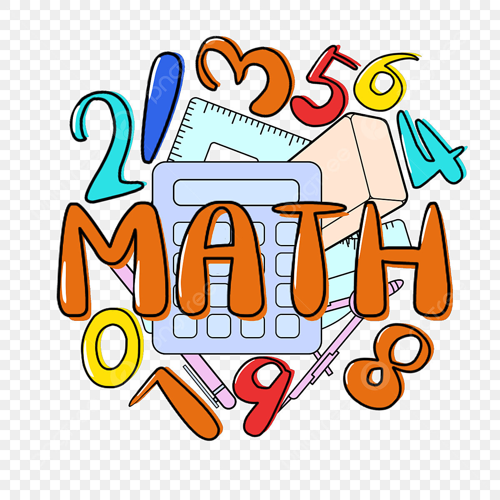

<!DOCTYPE HTML>
<html>
	<head>
		<meta charset="UTF-8">
		<link rel="preconnect" href="https://fonts.gstatic.com">
		<link href="https://fonts.googleapis.com/css2?family=Caudex&display=swap" rel="stylesheet"> 
		<link rel="stylesheet" href="./asset/style.css" type="text/css" media="screen" charset="utf-8"/>
		<title>Μαθηματικά Β Γυμνασίου</title>
	</head>

	<body>
		<header>
			

				

					
					<h1 class="mainTitle">Μαθηματικά Β Γυμνασίου</h1>
				

			

		</header>
		

			

				<nav>
					<ul class="menu">
						<li><a href="index.html">Αρχική</a></li>
                        <li>
							

								
<a href="#">Ύλη του μαθήματος</a>
							
								

									
<a href="material_algebra.html">Άλγεβρα</a>

									
<a href="material_geometry.html">Γεωμετρία</a>

								

							

						</li>
						<li>
<a href="theory.html">Επανάληψη βασικών Εννοιών Άλγεβρας</a>
</li>
						<li>
<a href="Quiz.php">Ασκήσεις</a>
</li>
					</ul>
				</nav>
				
	
					<iframe src="https://hmerologio.gr/iframe/cal" frameBorder="0" width="225px" height="200px" style="border:medium none;overflow:hidden;">
						
Ο browser σας δεν υποστηρίζει iframes. <a href="https://hmerologio.gr">hmerologio.gr</a>.

					</iframe><a href="https://hmerologio.gr" target="_blank" style="font-size:11px;font-family:monospace;position:absolute;bottom:11px;right:0px;display:inline-block;padding:0px 12px;z-index:15;color:#777;text-decoration:none;">hmerologio.gr</a>
				

				

					
				

			

			

				<article>
					<h2>Εισαγωγή</h2>
					
					
Η παρούσα ιστοσελίδα έχει δημιουργηθεί για εκπαιδευτικό σκοπό, απευθύνεται στους μαθητές της Β Γυμνασίου και πιο συγκεκριμένα στο μάθημα των Μαθηματικών. 

                    
Στην συγκεκριμένη ιστοσελίδα τόσο οι μαθητές όσο και οι γονείς θα μπορέσουν να βρούν ασκήσεις αλλά και θεωρία για το μάθημα των Μαθηματικών 

					
Επίσης η ιστοσελίδα περιέχει την ύλη του μαθήματος για το σχολικό έτος 2022 - 2023

					
					

						
						
Εικόνα του σχολικού βιβλίου

					

				</article>
			

		

		

			Designer: Protopapas Evangelos
		

	</body>
</html>
